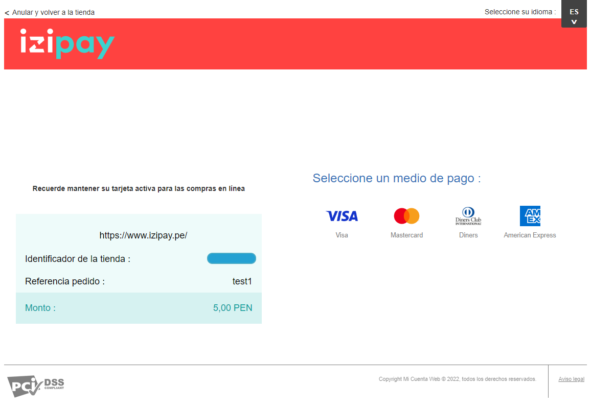

# [Redirect-PaymentForm-JavaScript]

## Índice

- [1. Introducción](#1-introducción)
- [2. Requisitos previos](#2-requisitos-previos)
- [3. Despliegue](#3-despliegue)
- [4. Datos de conexión](#4-datos-de-conexión)
- [5. Transacción de prueba](#5-transacción-de-prueba)
- [6. Implementación de la IPN](#6-implementación-de-la-ipn)
- [7. Personalización](#7-personalización)
- [8. Consideraciones](#8-consideraciones)

## 1. Introducción

En este manual podrás encontrar una guía paso a paso para configurar un proyecto de **[JavaScript]** con la pasarela de pagos de IZIPAY. Te proporcionaremos instrucciones detalladas y credenciales de prueba para la instalación y configuración del proyecto, permitiéndote trabajar y experimentar de manera segura en tu propio entorno local.
Este manual está diseñado para ayudarte a comprender el flujo de la integración de la pasarela para ayudarte a aprovechar al máximo tu proyecto y facilitar tu experiencia de desarrollo.

<p align="center">
  
</p>

<a name="Requisitos_Previos"></a>

## 2. Requisitos previos

- Comprender el flujo de comunicación de la pasarela. [Información Aquí](https://secure.micuentaweb.pe/doc/es-PE/rest/V4.0/javascript/guide/start.html)
- Extraer credenciales del Back Office Vendedor. [Guía Aquí](https://github.com/izipay-pe/obtener-credenciales-de-conexion)
- Para este proyecto utilizamos la herramienta Visual Studio Code.
  > [!NOTE]
  > Tener en cuenta que, para que el desarrollo de tu proyecto, eres libre de emplear tus herramientas preferidas.

## 3. Despliegue

### Instalar Live Server

Live Server, extensión para Visual Studio Code que simula un servidor web. Para instalarlo:

1. Ingresar a la sección "Extensiones" de Visual Studio Code
2. Buscar "Live Server"
3. Instalar extensión

<p align="center">
  
</p>

### Clonar el proyecto:

```sh
git clone [https://github.com/izipay-pe/Redirect-PaymentForm-JavaScript.git]
```

### Ejecutar proyecto

Accede al archivo `index.html` dentro de la carpeta `src` y de clic derecho dentro del código HTML, busca la opción `open with Live Server` para ejecutarlo, se abrirá en tu navegador el proyecto y podrá acceder en la siguiente ruta:

```sh
http://127.0.0.1:5500/src/index.html
```

<p align="center">
  
</p>

## 4. Datos de conexión

**Nota**: Reemplace **[CHANGE_ME]** con su credencial de `Claves` extraída desde el Back Office Vendedor, ver [Requisitos Previos](#Requisitos_Previos).

- Editar el archivo en la siguiente ruta `Redirect-PaymentFormT1-JavaScript-main -> src -> index.html` con las claves de su Back Office Vendedor.

  - Ingresar el `Identificador de la tienda` del Back Office Vendedor en el parámetro `value`.

  ```html
  <div class="inputContainer">
  	<input
  		id="campo7"
  		type="text"
  		class="input"
  		placeholder=""
  		name="vads_site_id"
  		value="~~CHANGE_ME_id~~"
  		readonly
  	/>
  	<label for="" class="label">vads_site_id / (CODIGO DE LA TIENDA)</label>
  </div>
  ```

  - Ingresar la `Clave de test o Clave de producción` de Back Office Vendedor en el parámetro `value`.

  ```html
  <input id="key" type="hidden" value="~~CHANGE_ME_key~~" />
  ```

- Para los demás campos verificar el manual descargado en los [Requisitos Previos](#Requisitos_Previos).

  - En el capítulo `5. ENVIAR UN FORMULARIO DE PAGO EN POST` se describe todos los datos que podemos enviar en nuestro formulario de pago, `en la pagina 21` se muestra un ejemplo de como se debería estructurar el html y como se pueden enviar dentro de nuestro formulario de pago.

    

  - Para los campos que tienen un valor ya establecido en `value` se recomienda que los cambie solo cuando verifique el manual y los datos del parámetro que está modificando, se recomienda dejar los valores predefinidos para este ejemplo.

    Ejemplo 1: Para el campo `vads_action_mode` que se define como un: _Modo de adquisición de la información del medio de pago_, el valor que indica el manual es el `INTERACTIVE`, por ese motivo se predefine este campo y se bloquea con `readonly` para no ser editado.

    ```html
    <div class="inputContainer">
    	<input
    		id="campo1"
    		type="text"
    		class="input"
    		placeholder=""
    		name="vads_action_mode"
    		value="INTERACTIVE"
    		readonly
    	/>
    	<label for="" class="label">vads_action_mode</label>
    </div>
    ```

    Ejemplo 2: Para el campo `vads_amount` que se define como el: _Monto del pago en su unidad monetaria más pequeña que es el centavo o céntimos)_, este campo puede ser editado y no tiene un valor predefinido, ya que enviara el monto a pagar en el formulario y depende del usuario.

    ```html
    <div class="inputContainer">
    	<input
    		id="campo2"
    		type="text"
    		class="input"
    		placeholder=""
    		name="vads_amount"
    		value=""
    	/>
    	<label for="" class="label">vads_amount / (MONTO A PAGAR)</label>
    </div>
    ```

## 5. Transacción de prueba

Antes de poner en marcha su pasarela de pago en un entorno de producción, es esencial realizar pruebas para garantizar su correcto funcionamiento.

Puede intentar realizar una transacción utilizando una tarjeta de prueba con la barra de herramientas de depuración (en la parte inferior de la página).

<p align="center">
  
</p>

- También puede encontrar tarjetas de prueba en el siguiente enlace. [Tarjetas de prueba](https://secure.micuentaweb.pe/doc/es-PE/rest/V4.0/api/kb/test_cards.html)

## 6. Implementación de la IPN

> [!IMPORTANT]
> Es recomendable implementar la IPN para comunicar el resultado de la solicitud de pago al servidor del comercio.

La IPN es una notificación de servidor a servidor (servidor de Izipay hacia el servidor del comercio) que facilita información en tiempo real y de manera automática cuando se produce un evento, por ejemplo, al registrar una transacción.
Los datos transmitidos en la IPN se reciben y analizan mediante un script que el vendedor habrá desarrollado en su servidor.

- Ver manual de implementación de la IPN. [Aquí](https://secure.micuentaweb.pe/doc/es-PE/rest/V4.0/kb/payment_done.html)
- Vea el ejemplo de la respuesta IPN con PHP. [Aquí](https://github.com/izipay-pe/Redirect-PaymentForm-IpnT1-PHP)
- Vea el ejemplo de la respuesta IPN con NODE.JS. [Aquí](https://github.com/izipay-pe/Response-PaymentFormT1-Ipn)

## 7. Personalización

Si deseas aplicar cambios específicos en la apariencia de la pasarela de pago, puedes lograrlo mediante la modificación de código CSS. En este enlace [Código CSS - Incrustado](https://github.com/izipay-pe/Personalizacion-PaymentForm-Incrustado) podrá encontrar nuestro script para un formulario incrustado.

## 8. Consideraciones

Para obtener más información, echa un vistazo a:

- [Formulario incrustado: prueba rápida](https://secure.micuentaweb.pe/doc/es-PE/rest/V4.0/javascript/quick_start_js.html)
- [Primeros pasos: pago simple](https://secure.micuentaweb.pe/doc/es-PE/rest/V4.0/javascript/guide/start.html)
- [Servicios web - referencia de la API REST](https://secure.micuentaweb.pe/doc/es-PE/rest/V4.0/api/reference.html)
